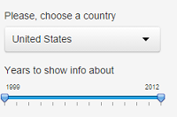

```{r setup, cache = F, echo = F, message = F, warning = F, tidy = F, results='hide'}
data <- read.csv("map_data_GRI.csv", header = TRUE, sep = ";",comment.char= "")
inputYears <- colnames(data)[2:length(data)]
colnames(data)[2:length(data)]<-sub(pattern = "X*", replacement = "", x = inputYears)
colnames(data)[1]<-"Country"

myPlot <- function(countryName, timeInterval, values){
  plot(timeInterval, values, 
       type ="b", xlab="years", ylab="Number of GRI reports", 
       pch = 19, main = countryName)
  fit<-lm(values~timeInterval)
  beta <- round(fit$coefficients, 4)
  regr.formula = paste("y = ", beta[1]," + ",beta[2],"*x")
  mtext(regr.formula, col = "blue")
  abline(fit, col = "blue", lw = 2)
  confData <- data.frame(x = timeInterval)
  pred<-predict(fit, confData, interval = ("prediction"))
  lines(timeInterval, pred[,2], lty = 2);
  lines(timeInterval, pred[,3], lty = 2);
}

emptyPlot<- function(countryName, timeInterval){
  if (length(timeInterval>1)){
    plot(x = timeInterval, y = rep(0, length(timeInterval)), type = "n", 
         xlab = "years", ylab = "Number of GRI reports", main = countryName)  
  } else {
    plot(x = timeInterval, y = 0, type = "n", 
         xlab = "year", ylab = "Number of GRI reports", main = countryName)  
  }
  mtext("Sorry, not enough data to predict. Please, try another country or time interval.", col = "red")
}

dataSet <-function(countryName, timeInterval){
  x <- timeInterval
  country <- countryName
  y <- data[data$Country==country, colnames(data) %in% x]
  good<- !is.na(y)
  y.good<-y[good]
  x.good<-x[good]
  data.good<-data.frame(years = x.good, reports = y.good)
  data.good
}

prediction <- function(data.in) {    
  
      if (length(data.in$years)>2){
        timeInterval<-data.in$years
        reports<-data.in$reports
        fit<-lm(reports~timeInterval)
        nextYear<-timeInterval[length(timeInterval)]+1
        timeInterval <- append(timeInterval, nextYear)
        confData <- data.frame(x = timeInterval)
        pred<-predict(fit, confData, interval = ("prediction"))
        str<-paste("Based on input parameters, in ",nextYear," number of GRI reports could be in [", 
        max(0,round(pred[dim(pred)[1],2])),",",
        max(0,round(pred[dim(pred)[1],3])), 
        "] interval.")
      } else {
        str<-paste ("Prediction is not possible.")
      }
    str
    }
```
## GRI
- Global reporting initiative [(GRI)] (https://www.globalreporting.org/Pages/default.aspx) is an organization, which helps companies all over the world to unify their non-financial reporting in terms of [sustainable development] (http://en.wikipedia.org/wiki/Sustainable_development)

- [Shiny application] (https://sanic.shinyapps.io/DataProducts_CourseProject/) 
uses pre-processed data, obtained from appropriate 
[database] (http://database.globalreporting.org/search)
about numbers of reports, published by companies of different countries in the world

- Application shows prediction interval of possible report numbers at the year right 
after the last one from the selected interval

- 'Prediction' is quite theoretical, based on the simpliest linear regression model and, of course, can be improved:) 

---
## Input/Output example

* Based on selected country and years interval, we get appropriate output:

```{r showPlot, echo=FALSE}
#data.good<-dataSet()
#myPlot("United States", data.good$years, data.good$reports)
```

---
## Prediction results
- Selected interval from 1999 to 2012 for US contains data for all 14 years
- Blue line is the regression line, for which formula is represented right below the plot name (selected country). Dashed lines are prediction intervals, based on simple linear regression model.
- The year of prediction is 2013, because it follows 2012 - the last one from selected interval
- Prediction algorithm gives the following output on correct input data:
```{r predictionFullRes, echo=FALSE}
data.full<-dataSet("United States", c(1999:2012))
prediction(data.full)
    
```
- In case of two or less data points appropriate notification is shown to the user:
```{r predictionEmptyRes, echo=FALSE}
data.empty<-dataSet("Afghanistan", c(2002:2010))
prediction(data.empty)
```    

--- 
## Conclusions

- Published application tries to 'predict' number of GRI reports in given country at the year after the end of selected interval based in input data from that interval
- This approach can't be used for real life, but is very rough estimation of countries' sustainability based on information about their companies (who publish non-financial reports)
- Prediction considers interval instead of exact eexpected number of reports, which better shows uncertainty
- That's motivation for companies to publish non-financial reports for better ranks among countries :)