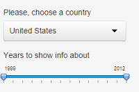
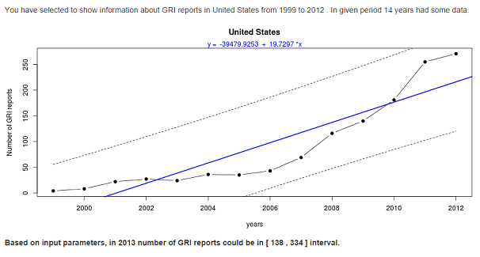

## GRI
- Global reporting initiative [(GRI)] (https://www.globalreporting.org/Pages/default.aspx) is an organization, which helps companies all over the world to unify their non-financial reporting in terms of [sustainable development] (http://en.wikipedia.org/wiki/Sustainable_development)

- [Shiny application] (https://sanic.shinyapps.io/DataProducts_CourseProject/) 
uses pre-processed data, obtained from appropriate 
[database] (http://database.globalreporting.org/search)
about numbers of reports, published by companies of different countries in the world

- Application shows prediction interval of possible report numbers at the year right 
after the last one from the selected interval

- 'Prediction' is quite theoretical, based on the simpliest linear regression model and, of course, can be improved:) 

---
## Input/Output example

* Based on selected country and years interval, we get appropriate output:



---
## Prediction results
- Selected interval from 1999 to 2012 for US contains data for all 14 years
- Blue line is the regression line, for which formula is represented right below the plot name (selected country). Dashed lines are prediction intervals, based on simple linear regression model.
- The year of prediction is 2013, because it follows 2012 - the last one from selected interval
- Prediction algorithm gives the following output on correct input data:

```
## [1] "Based on input parameters, in  2013  number of GRI reports could be in [ 138 , 334 ] interval."
```
- In case of two or less data points appropriate notification is shown to the user:

```
## [1] "Prediction is not possible."
```

--- 
## Conclusions

- Published application tries to 'predict' number of GRI reports in given country at the year after the end of selected interval based in input data from that interval
- This approach can't be used for real life, but is very rough estimation of countries' sustainability based on information about their companies (who publish non-financial reports)
- Prediction considers interval instead of exact eexpected number of reports, which better shows uncertainty
- That's motivation for companies to publish non-financial reports for better ranks among countries :)
